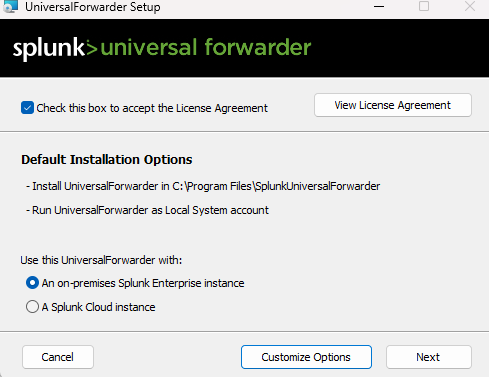
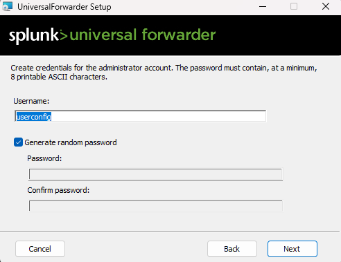
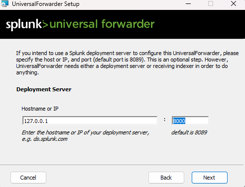

# Splunk Enterprise Setup and Configuration

Splunk Enterprise was installed in the default directory:
C:\Program Files\SplunkUniversalForwarder.
During installation, the Universal Forwarder was selected to transmit log data to a local, on-premises Splunk Enterprise instance for centralized monitoring and analysis.

A secure administrator account was created with strong credentials. A randomly generated password was securely stored to ensure proper access control and reduce the risk of credential exposure.

The Universal Forwarder was configured to communicate with the local Splunk Enterprise instance using the loopback IP address 127.0.0.1 and the default management port 8000.

To verify successful installation and service status, Windows PowerShell was used to execute the following command:
Get-Service splunkforwarder

The service was confirmed to be active and running, indicating that data forwarding capabilities were operational.

After confirming proper setup, the Splunk Enterprise web interface was accessed through the browser at http://127.0.0.1:8000. The default dashboard layout successfully loaded, displaying system health indicators and confirming the instance was fully functional.

The local host event collection logs are set to capture and filter based on specified events.

Configured a new custom alert in Splunk to monitor Windows Security EventCode 4655, which corresponds to failed login attempts.
This alert continuously tracks authentication failures and triggers a real-time notification whenever multiple failed logins occur within a defined time window.

